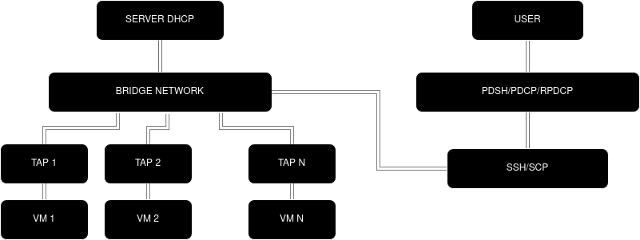

## Documentație Proiect

## 1. Descrierea Problemei

### De ce este necesar?

* Operarea simultană și în masă a **mai multor sisteme/noduri** (management de cluster).
* **Exemplu de caz de utilizare:**
    * Servicii de servere (ex: Amazon EC2).
    * Configurarea multiplă de sisteme într-un mediu de birou.

### Soluții Posibile

Reimplementarea utilitatilor standard pentru execuția paralelă de comenzi și transferul de fișiere:
* **`pdsh`**: Rularea de comenzi în paralel.
* **`pdcp`**: Încărcarea (upload) de fișiere în paralel.
* **`rpdcp`**: Descărcarea (download) de fișiere în paralel.

---

## 2. Specificația Soluției

### Obiective

* **Deployment ușor** al nodurilor de Mașini Virtuale (VM-uri).
* **Reimplementarea** funcționalităților cheie ale comenzilor `pdsh/pdcp/rpdcp`.

### Mediu de Rulare

* Soluția rulează în **terminal**.

### Cerințe Tehnice

* Sistem de operare: **Linux**.
* Shell: **Bash**.
* Limbaj de programare: **Python**.
* Protocol: **SSH/SCP** (pentru conectare securizată).
* Virtualizare: **KVM** și **QEMU**.

### Limitări

* Configurarea nodurilor **nu** adaugă automat `hostname`-uri în fișierul `/etc/hosts`.
* Sistemul de *logging* (monitorizare) este **probabil limitat**.

### Plan de Evaluare

* Dezvoltarea unui **script de teste** bazat pe cazuri de utilizare (use case-uri).

---

## 3. Design


### Explicații de Design





* **Rețeaua Bridge și DHCP**: Se folosește un `bridge network` cu un **server DHCP** pentru a asigura un **IP static și unic** pentru fiecare VM în mod automat.
    * *Motivație*: Fără un IP unic și cunoscut, VM-urile nu pot fi accesate.
* **Alegerea Metodei**: Această metodă a fost aleasă în detrimentul `qemu-guest-agent` deoarece permite o **conectare universală** atât la VM-uri, cât și la sisteme externe, din afara specificațiilor inițiale ale proiectului.

### Descrierea Mecanismelor

* **DHCP Server**: Rulează pe `bridge network` pentru a forța VM-urile să obțină un **IP static și unic**, făcându-le accesibile pentru **USER**.
* **Comenzi PDSH/PDCP/RPDCP**: Utilizează protocoalele **SSH/SCP** pentru o conectare securizată și **paralelă** la toate nodurile.
    * **Python (sau AWK)** este folosit pentru **manipularea și prelucrarea argumentelor** primite de scripturile Bash.

---

## 4. Implementare

### Stack Tehnologic

* **Python (AWK?)**: Pentru manipularea șirurilor de caractere (stringuri).
* **SSH/SCP**: Conectare securizată la noduri.
* **QEMU**: Interfață pentru rularea VM-urilor folosind **KVM**.
* **Alpine Linux**: Distribuție *lightweight* aleasă pentru VM-uri.
* **Git/GitHub**: Pentru controlul versiunilor (*version control*).

### Probleme Apărute & Soluții

| Problemă | Soluție |
| :--- | :--- |
| Atribuirea IP-urilor unice pentru VM-uri | Obținerea unui IP static (Soluție: `got good`) |
| Serverul DHCP blocat de firewall | Adăugarea unei excepții în firewall pentru serviciul DHCP |

---
# MOD DE FOLOSIRE

!!! Funcționalitate limitată, work in progress !!!

# Setup


## `copyVM`

<br>

Scriptul `./copyVM` creează un număr specificat de copii ale unei imagini VM date.
Clonele sunt indexate de la `1` la `n`. În cazul în care scriptul este rulat de mai multe ori, indexul continuă de la ultimul clone creat.

```bash
./copyVM -i [path/to/image] -n [numberOfClones] 

```

<br>

`-i` : locația imaginii VM
`-n` : numărul de clone

<br>

## `startVMs`

Scriptul `./startVMs` pornește toate VM-urile dintr-un director specificat.
De asemenea, permite configurarea unui `bridge network` și a unor `tap-uri` pentru fiecare nod VM.

!!! Important

Pentru a te asigura că fiecare nod VM primește automat un `ip static`, trebuie să ai un `server dhcp` care rulează pe `bridge network`.
Scriptul nu include mapări în `/etc/hosts` pentru fiecare nod (nu este planificat momentan, sorry :3).
`Bridge network-ul` nu este persistent.

```bash
./startVMs -d [directory] -ns -b [bridgeName]

```

<br>

`-d` : locația nodurilor
`-ns` : setup pentru bridge network (dacă este omis, va fi necesar setup manual pentru fiecare nod)
`-b` : numele pentru bridge network (dacă este omis, valoarea implicită este `megatron`)

<br>

